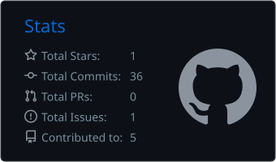

# 10fax01

Cyber Security /\ Reverse Engineering /\ Windows Internals

## About

Hi I'm 10fax01. I do cyber security related work.

My public work currently includes vulnerable Windows driver research, BYOVD, reverse engineering, and symbol mapping.

## Projects

### [HP_SWTOOLS_DRIVER](https://github.com/10fax01/HP_SWTOOLS_DRIVER)

Vulnerable HP driver research with a C++ PoC.

### [BYOVD](https://github.com/10fax01/BYOVD)

Write-up covering Bring Your Own Vulnerable Driver and how to find them.

### [Symbol-Mapping-Guide](https://github.com/10fax01/Symbol-Mapping-Guide)

IDA guide for finding and mapping obfuscated Unity symbols.

## Languages and Tools

  
  
  
  
  

## GitHub Activity

  

## Contact

